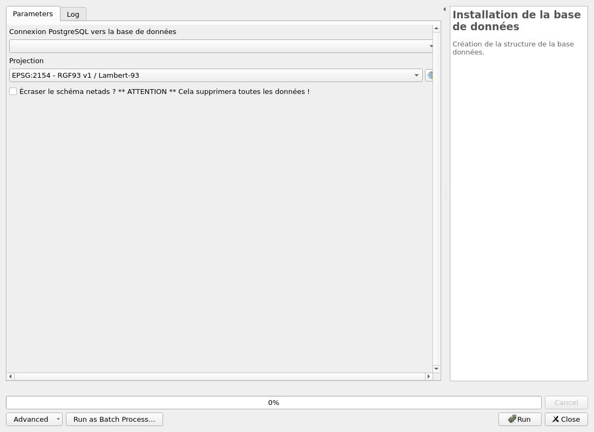
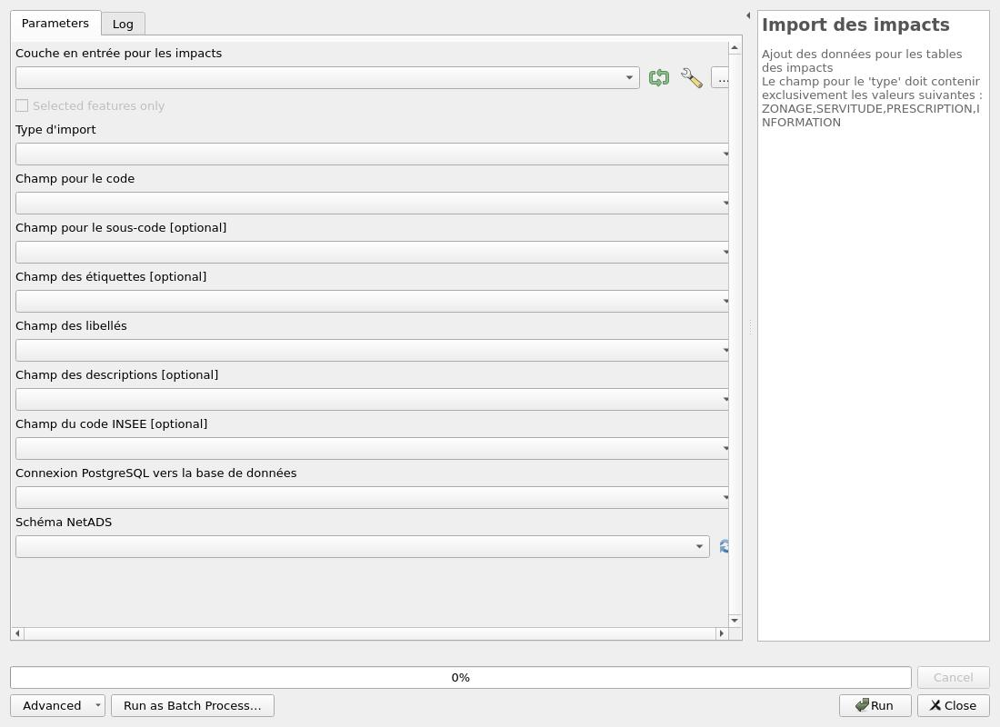
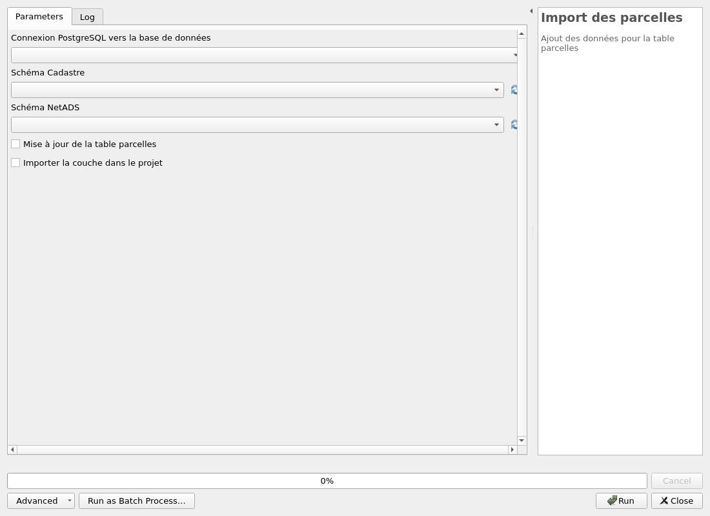

---
hide:
  - navigation
---

# Processing

## Base de données

### Installation de la base de données

Création de la structure de la base données. 

#### Parameters

| ID | Description | Type | Info | Required | Advanced | Option |
|:-:|:-:|:-:|:-:|:-:|:-:|:-:|
CONNECTION_NAME|Connexion PostgreSQL vers la base de données|ProviderConnection|Nom de la connexion dans QGIS pour se connecter à la base de données|✓|||
CRS|Projection|Crs||✓||Default: EPSG:2154   |
OVERRIDE|Écraser le schéma netads ? ** ATTENTION ** Cela supprimera toutes les données !|Boolean||✓|||

#### Outputs

| ID | Description | Type | Info |
|:-:|:-:|:-:|:-:|
DATABASE_VERSION|Version de la base de données|String||

***

### Mise à jour de la base de données

Mise à jour de la structure de la base données. 

#### Parameters

| ID | Description | Type | Info | Required | Advanced | Option |
|:-:|:-:|:-:|:-:|:-:|:-:|:-:|
CONNECTION_NAME|Connexion PostgreSQL vers la base de données|ProviderConnection|Nom de la connexion dans QGIS pour se connecter à la base de données|✓|||
CRS|Projection|Crs||✓||Default: EPSG:2154   |
RUN_MIGRATIONS|Cocher cette option pour lancer la mise-à-jour.|Boolean||✓|||

#### Outputs

| ID | Description | Type | Info |
|:-:|:-:|:-:|:-:|
OUTPUT_STATUS|Output status|Number||
OUTPUT_STRING|Output message|String||

***

## Import des données

### Import des communes

Ajout des données pour la table communes

#### Parameters

| ID | Description | Type | Info | Required | Advanced | Option |
|:-:|:-:|:-:|:-:|:-:|:-:|:-:|
CONNECTION_NAME|Connexion PostgreSQL vers la base de données|ProviderConnection|Base de données de destination|✓|||
SCHEMA_CADASTRE|Schéma Cadastre|DatabaseSchema|Nom du schéma des données cadastre|✓||Default: cadastre   |
SCHEMA_NETADS|Schéma NetADS|DatabaseSchema|Nom du schéma des données NetADS|✓||Default: netads   |
TRUNCATE_PARCELLES|Mise à jour de la table communes|Boolean||✓|||
IMPORT_PROJECT_LAYER|Importer la couche dans le projet|Boolean||✓|||

#### Outputs

| ID | Description | Type | Info |
|:-:|:-:|:-:|:-:|
OUTPUT|Couches de sortie|MultipleLayers||

***

### Import des impacts

Ajout des données pour les tables des impacts Le champ pour le 'type' doit contenir exclusivement les valeurs suivantes : ZONAGE,SERVITUDE,PRESCRIPTION,INFORMATION

#### Parameters

| ID | Description | Type | Info | Required | Advanced | Option |
|:-:|:-:|:-:|:-:|:-:|:-:|:-:|
ENTREE|Couche en entrée pour les impacts|FeatureSource|Couche vecteur qu'il faut importer dans la base de données|✓|||
TYPE_IMPORT|Type d'import|Enum|Type d'import concernant la couche|✓||Values: ZONAGE, SERVITUDE, PRESCRIPTION, INFORMATION  |
CHAMP_CODE|Champ pour le code|Field|Zonage, Impacts, Servitudes, Droit de Préemption, Lotissement, ou tout autre valeur libre|✓|||
CHAMP_SOUS_CODE|Champ pour le sous-code|Field|Valeur libre||||
CHAMP_ETIQUETTE|Champ des étiquettes|Field|Champ des étiquettes pour l'impact||||
CHAMP_LIBELLE|Champ des libellés|Field|Champ des libellés pour l'impact|✓|||
CHAMP_DESCRIPTION|Champ des descriptions|Field|Champ des libellés pour l'impact||||
CHAMP_INSEE|Champ du code INSEE|Field|Champ du code INSEE pour l'impact. Si le champ n'est pas fourni, le code INSEE proviendra de l'intersection avec la commune.||||
CONNECTION_NAME|Connexion PostgreSQL vers la base de données|ProviderConnection|Base de données de destination|✓|||
SCHEMA_NETADS|Schéma NetADS|DatabaseSchema|Nom du schéma des données NetADS|✓||Default: netads   |

#### Outputs

| ID | Description | Type | Info |
|:-:|:-:|:-:|:-:|
COUNT_FEATURES|Nombre d'entités importés|Number||
COUNT_NEW_IMPACTS|Nombre de nouveaux impacts|Number||

***

### Import des parcelles

Ajout des données pour la table parcelles

#### Parameters

| ID | Description | Type | Info | Required | Advanced | Option |
|:-:|:-:|:-:|:-:|:-:|:-:|:-:|
CONNECTION_NAME|Connexion PostgreSQL vers la base de données|ProviderConnection|Base de données de destination|✓|||
SCHEMA_CADASTRE|Schéma Cadastre|DatabaseSchema|Nom du schéma des données cadastre|✓||Default: cadastre   |
SCHEMA_NETADS|Schéma NetADS|DatabaseSchema|Nom du schéma des données NetADS|✓||Default: netads   |
TRUNCATE_PARCELLES|Mise à jour de la table parcelles|Boolean||✓|||
IMPORT_PROJECT_LAYER|Importer la couche dans le projet|Boolean||✓|||

#### Outputs

| ID | Description | Type | Info |
|:-:|:-:|:-:|:-:|
OUTPUT|Couches de sortie|MultipleLayers||

***

### Chargement des couches depuis la base

Charger les couches de la base de données. Le code client est obligatoire si il n'est pas fourni dans le projet dans une variable de projet 'netads_idclient'.

#### Parameters

| ID | Description | Type | Info | Required | Advanced | Option |
|:-:|:-:|:-:|:-:|:-:|:-:|:-:|
CONNECTION_NAME|Connexion PostgreSQL vers la base de données|ProviderConnection|Base de données où sont stockés les données|✓|||
SCHEMA|Schéma|DatabaseSchema|Nom du schéma des données netads|✓||Default: netads   |
CODE_CLIENT|Code client NetADS|String|Code client NetADS attribué à la collectivité||||
PREFIX_PARCELLE|Préfixe parcellaire|String|Code départemental (2 caractères) et code de direction (1 caractère)||||

#### Outputs

| ID | Description | Type | Info |
|:-:|:-:|:-:|:-:|
OUTPUT|Couches de sortie|MultipleLayers||

***

